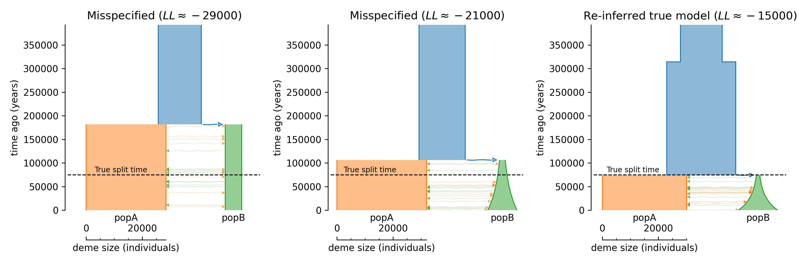

## Example 1: Reinferring simulated parameters

Here, we use msprime to simulate a 2-population split-with-migration model,
in which an ancestral parental population splits some time in the past, and
the descendent populations change sizes over time and exchange migrants.

### The ground-truth demographic model

The input model ([model.yaml](models_and_fits/model.yaml)), which is loosely
based on inferences of human history (see example 2):
```YAML
generation_time: 29
time_units: years
demes:
- name: ancestral
  epochs:
  - {start_size: 15000, end_time: 300000}
  - {start_size: 25000, end_time: 75000}
- name: popA
  ancestors: [ancestral]
  epochs:
  - {start_size: 30000}
- name: popB
  ancestors: [ancestral]
  epochs:
  - {start_size: 1200, end_size: 14000}
migrations:
- demes: [popA, popB]
  rate: 5e-5
```

Using the following to load and plot the model:
```python
import demes, demesdraw, matplotlib.pylab as plt
import moments

g = demes.load("models_and_fits/model.yaml")
fig = plt.figure(figsize=(5, 4))
ax = plt.subplot(1, 1, 1)
demesdraw.tubes(g, ax=ax)
fig.tight_layout()
fig.savefig("model.png")
```


### Simulating data with msprime

We suppose we sample 30 individuals from each population A and B. We'll
simulate 500 1Mb sequences, aggregating across replicates to construct the SFS
and to approximate the process of creating bootstrapped replicate spectra. The
python script used for simulating data is [simulate_data.py](simulate_data.py).

Visualize the marginal spectra:
```python
data = moments.Spectrum.from_file("data/data.fs")

moments.Plotting.plot_1d_comp_Poisson(
    data.marginalize([1]),
    data.marginalize([0]),
    labels=data.pop_ids,
    out="marginal_spectra.png",
)
```


By running `fs.Fst()`, we find an FST value of between around 0.065 to 0.07.

### Running inference

We'll first fit a two simpler (misspecified) models that don't allow for
size changes within the ancestral populations.

The first model assumes constant sizes in each of the three demes (the
ancestral population and the two sampled populations). Our initial model guess
is given by [model.misspec.yaml](models_and_fits/model.misspec.yaml):
```YAML
description: split-with-migration model, with constant sizes and symmetric migration
generation_time: 29
time_units: years
demes:
- name: ancestral
  epochs:
  - {start_size: 10000, end_time: 100000}
- name: popA
  ancestors: [ancestral]
  epochs:
  - {start_size: 20000}
- name: popB
  ancestors: [ancestral]
  epochs:
  - {start_size: 20000}
migrations:
- demes: [popA, popB]
  rate: 1e-4
```

To run inference using `moments.Demes.Inference`, we also need the parameters
options file, which here is defined in
[model.misspec.options.yaml](models_and_fits/model.misspec.options.yaml).
In this file, we specify which parameters to optimize, which values in the
Demes-specified model to fit, and impose any bounds on those parameters:
```YAML
parameters:
- name: Ne
  values:
  - demes:
      ancestral:
        epochs:
          0: start_size
  lower_bound: 500
  upper_bound: 500000
- name: NA
  values:
  - demes:
      popA:
        epochs:
          0: start_size
  lower_bound: 500
  upper_bound: 500000
- name: NB
  values:
  - demes:
      popB:
        epochs:
          0: start_size
  lower_bound: 500
  upper_bound: 500000
- name: T
  values:
  - demes:
      ancestral:
        epochs:
          0: end_time
  lower_bound: 0
  upper_bound: 500000
- name: m
  values:
  - migrations:
      0: rate
  lower_bound: 1e-8
  upper_bound: 1e-2
```

Optimization then can be performed using the `moments.Demes.Inference.optimize`
function:
```python
import moments
import gzip
import pickle

# Load the data
data = moments.Spectrum.from_file("data/data.fs")

# Specify model paths
g_in = "models_and_fits/model.misspec.yaml"
options = "models_and_fits/model.misspec.options.yaml"
g_out = "models_and_fits/model.misspec.out.yaml"

# Parameters from simulated data
u = 1e-8
num_reps = 500
L = 1e6
U = u * L * num_reps


# Run fit
ret = moments.Demes.Inference.optimize(
    g_in,
    options,
    data,
    method="fmin",
    perturb=1,
    uL=U,
    output=g_out,
    overwrite=True
)

# ret stores parameter names, optimal values, and the log-likelihood
params, vals, ll = ret
print("Param\tBest fit value")
for p, v in zip(params, vals):
    print(f"{p}\t{v}")
```
This prints
```
Param	Best fit value
Ne	15324.101946214449
NA	28453.36696520237
NB	5922.663260471864
T	181743.50274735267
m	6.47082934291272e-05
```

The output optimized demes model is stored in
[model.misspec.out.yaml](models_and_fits/model.misspec.out.yaml).

We similarly perform inference for a model that allows for exponential size
changes in `popB` while assuming constant size changes in the ancestor, and
for the simulated model in which we reinfer parameters assuming no model
misspecification. The scripts to run these optimizations are found in this
directory.

To compare model fits between misspecified and correctly specified models,
we use `demesdraw` to plot output models. The plotting script is also found
in this directory.


Model misspecification can cause large biases in inferred parameters, which can
influence our interpretation of demographic history. Here, we've seen that
ignoring size changes in the history of the population biases the inferred
divergence times of populations. [Momigliano et al.
(2020)](https://academic.oup.com/mbe/article/38/7/2967/6149129) have previously
demonstrated this effect, finding that when the shared ancestral population
experiences an expansion prior to the time of divergence, split times are
systematically overestimated if that feature of the history is not accounted
for.

### Confidence intervals

Parameter uncertainties can be computed using two methods: the Fisher
Information Matrix (FIM) or the Godambe Information Matrix (GIM) approaches.
The FIM approach makes the assumption that all sites in the SFS are
independent, and therefore will underestimate standard errors due to linkage
between sites. Linkage leads to non-independence of data, so the "effective"
number of sites is lower than the actual number of sites aggregated in the SFS.

```python
uncerts_FIM = moments.Demes.Inference.uncerts(
    g_out,
    options,
    data,
    uL=U,
    method="FIM",
)

print("Using FIM:")
print("Param\tBest fit value\t\tCIs (two standard errors)")
for p, v, u in zip(params, vals, uncerts_FIM):
    print(f"{p}\t{v}\t{v-2*u}\t{v+2*u}")
```
```
Using FIM:
Param	Best fit value		CIs (two standard errors)
Ne	15324.101946214449	15286.037586035543	15362.166306393354
NA	28453.36696520237	28349.157840481796	28557.576089922946
NB	5922.663260471864	5901.521301929835	5943.805219013893
T	181743.50274735267	180224.7190832122	183262.28641149314
m	6.47082934291272e-05	6.432508087886291e-05	6.50915059793915e-05
```

We note that the confidence intervals are very narrow.

Instead, the GIM approach attempts to correct for this non-independence of data
using bootstrap replicates (constructed by sampling with replacement of blocks
of the genome), as described in [Coffman et al.
(2016)](https://academic.oup.com/mbe/article/33/2/591/2579696). In the simulation
script, we previously simulated bootstrap replicates, which are provided as a list
of frequency spectra.

```python
with gzip.open("data/bootstrapped_data.pkl.gz", "rb") as fin:
    bs_data = pickle.load(fin)

uncerts_GIM = moments.Demes.Inference.uncerts(
    g_out,
    options,
    data,
    bootstraps=bs_data,
    uL=U,
    method="GIM",
)

print("Using GIM")
print("Param\tBest fit value\t\tCIs")
for p, v, u in zip(params, vals, uncerts_GIM):
    print(f"{p}\t{v}\t{v-2*u}\t{v+2*u}")
```
```
Using GIM
Param	Best fit value		CIs
Ne	15324.101946214449	15226.701700325317	15421.50219210358
NA	28453.36696520237	28148.309068928713	28758.42486147603
NB	5922.663260471864	5863.737166137908	5981.58935480582
T	181743.50274735267	176102.81772249175	187384.1877722136
m	6.47082934291272e-05	6.321297805464062e-05	6.62036088036138e-05
```

Here, confidence intervals are wider, reflecting the underestimation of
uncertainty using the FIM approach compared to the GIM approach.
