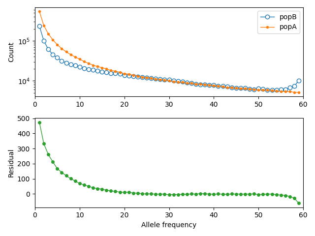

## Example 1: Reinferring simulated parameters

Here, we use msprime to simulate a 2-population split-with-migration model,
in which an ancestral parental population splits some time in the past, and
the descendent populations change sizes over time and exchange migrants.

### The ground-truth demographic model

The input model ([model.yaml](model.yaml)):
```YAML
description: split-with-migration model, loosely based on a human history (see example 2)
generation_time: 29
time_units: years
demes:
- name: ancestral
  epochs:
  - {start_size: 15000, end_time: 300000}
  - {start_size: 25000, end_time: 75000}
- name: popA
  ancestors: [ancestral]
  epochs:
  - {start_size: 30000}
- name: popB
  ancestors: [ancestral]
  epochs:
  - {start_size: 1200, end_size: 14000}
migrations:
- demes: [popA, popB]
  rate: 5e-5
```

Using the following to load and plot the model:
```python
import demes, demesdraw, matplotlib.pylab as plt
import moments

g = demes.load("model.yaml")
fig = plt.figure(figsize=(5, 4))
ax = plt.subplot(1, 1, 1)
demesdraw.tubes(g, ax=ax)
fig.tight_layout()
fig.savefig("model.png")
```


### Simulating data with msprime

Sample 30 individuals from each population A and B.
We'll simulate 500 1Mb sequences, aggregating across replicates
to construct the SFS.
[TODO: update with finalized code from simulate_data.py script!]
```python
import msprime
import numpy as np

n = 30
sample_sets = [msprime.SampleSet(n, "popA"), msprime.SampleSet(n, "popB")]
demog = msprime.Demography.from_demes(g)

# simulate 200 1Mb regions
L = 1e6
u = 1e-8
r = 1e-8
num_reps = 200

tss = msprime.sim_ancestry(
    samples=sample_sets,
    demography=demog,
    sequence_length=L,
    recombination_rate=r,
    num_replicates=num_reps,
    random_seed=42
)

# get list of replicate spectra
spectra = []
for i, ts in enumerate(tss):
    mts = msprime.sim_mutations(ts, rate=u, random_seed=i+13)
    fs_rep = mts.allele_frequency_spectrum(
        sample_sets=[range(2*n), range(2*n, 4*n)],
        polarised=True,
        span_normalise=False
    )
    spectra.append(fs_rep)

fs = np.sum(spectra, axis=0)

fs = moments.Spectrum(fs, pop_ids=["popA", "popB"])
```

Visualize the marginal spectra
```python
moments.Plotting.plot_1d_comp_Poisson(
    fs.marginalize([1]),
    fs.marginalize([0]),
    labels=fs.pop_ids,
    out="marginal_spectra.png",
)
```


By running `fs.Fst()`, we find an FST value of between around 0.065 to 0.07.

### Running inference

We'll first fit a simpler (misspecified) model that doesn't allow for
size changes within populations, and assumes a symmetric migration rate.

Our initial model guess is given by [model.misspec.yaml](model.misspec.yaml):
```YAML
description: split-with-migration model, with constant sizes and symmetric migration
generation_time: 29
time_units: years
demes:
- name: ancestral
  epochs:
  - {start_size: 10000, end_time: 100000}
- name: popA
  ancestors: [ancestral]
  epochs:
  - {start_size: 20000}
- name: popB
  ancestors: [ancestral]
  epochs:
  - {start_size: 20000}
migrations:
- demes: [popA, popB]
  rate: 1e-4
```

To run inference using `moments.Demes.Inference`, we also need the parameters
options file, which may be defined in
[model.misspec.options.yaml](model.misspec.options.yaml).
In this file, we specify which parameters to optimize, which values in the
Demes-specified model to fit, and impose any bounds on those parameters:
```YAML
parameters:
- name: Ne
  values:
  - demes:
      ancestral:
        epochs:
          0: start_size
  lower_bound: 500
  upper_bound: 500000
- name: NA
  values:
  - demes:
      popA:
        epochs:
          0: start_size
  lower_bound: 500
  upper_bound: 500000
- name: NB
  values:
  - demes:
      popB:
        epochs:
          0: start_size
  lower_bound: 500
  upper_bound: 500000
- name: T
  values:
  - demes:
      ancestral:
        epochs:
          0: end_time
  lower_bound: 0
  upper_bound: 500000
- name: m
  values:
  - migrations:
      0: rate
  lower_bound: 1e-8
  upper_bound: 1e-2
```

Optimization then can be performed as below:
```python
# Load the data
data = moments.Spectrum.from_file("data/data.fs")

# Specify model paths
g_in = "model.misspec.yaml"
options = "model.misspec.options.yaml"
g_out = "model.misspec.out.yaml"

# Parameters from simulated data
u = 1e-8
num_reps = 500
L = 1e6
U = u * L * num_reps


# Run fit
moments.Demes.Inference.optimize(
    g_in,
    options,
    data,
    verbose=1,
    method="fmin",
    perturb=1,
    uL=U,
    output=g_out,
    overwrite=True
)
```

The output optimized demes model is stored in [model.misspec.out.yaml](model.misspec.out.yaml).
Visualizing this fit:

