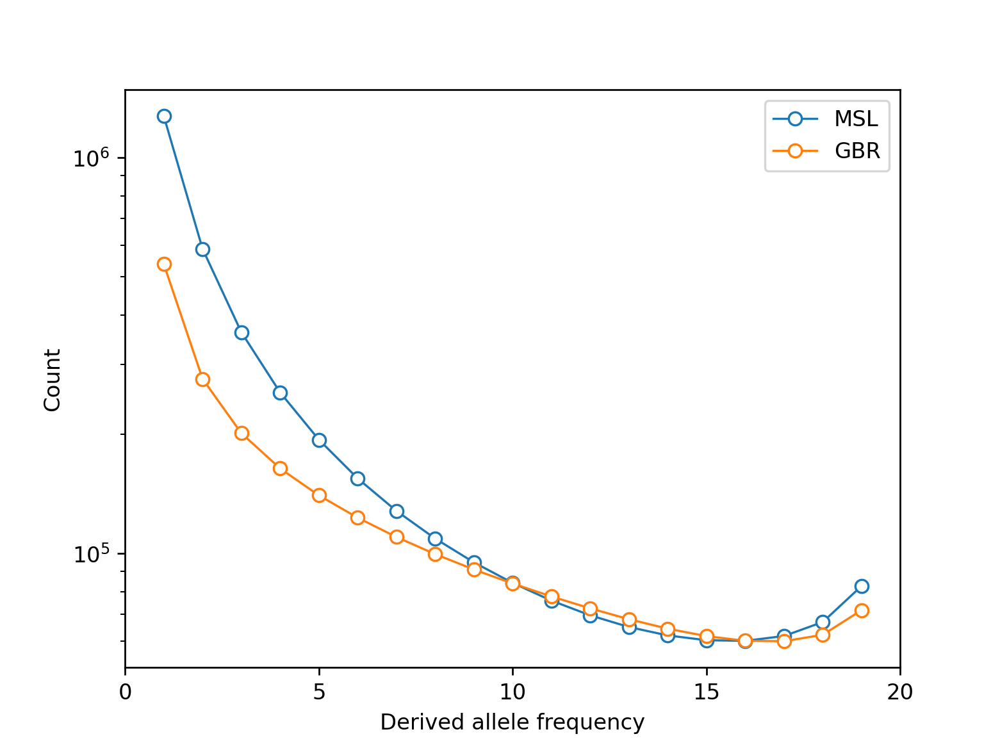
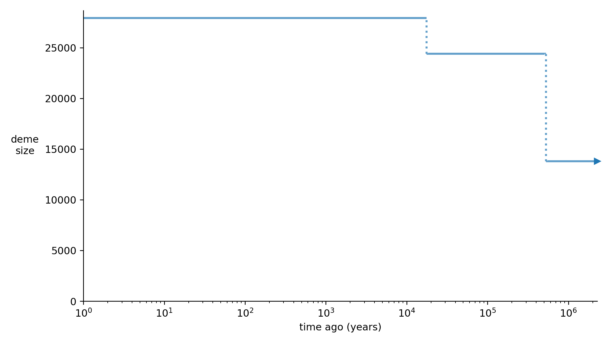
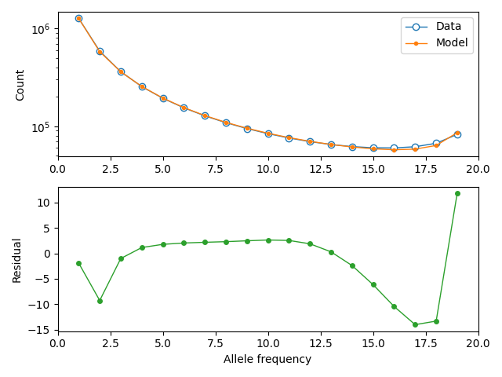

## Example 2: Inferring a model with empirical data 

In this section we use moments to do SFS inference, building a model of archaic admixture involving two modern human populations (MSL, Mende people from Sierre Leone, and GBR, British people from Great Britain) and the Vindija Neanderthal. 

### Estimating the SFS from sequence data


### Projecting the estimated SFS down

With close to 100 diploid genomes in each of two populations, the SFS we have estimated is large and we may wish to project it down to smaller sample sizes to speed up parameter optimization. We can also marginalize out populations to obtain single-population spectra.

```python
import moments
sfs = moments.Spectrum.from_file("data/data_msl_gbr_chs_vindija.bp")
sfs.pop_ids
>>> ['MSL', 'CHS', 'GBR', 'Vindija']
sfs.sample_sizes
>>> array([170, 210, 182,   2])
# marginalize to MSL
sfs_msl = sfs.marginalize([1, 2, 3])
sfs_msl_projected = sfs_msl.project([20])
sfs_msl_projected.to_file("data/data_msl.bp")
# marginalize to GBR, MSL and Vindija 
sfs_3_pop = sfs.marginalize([1])
sfs_3_pop_projected = sfs_3_pop.project([20, 20, 2])
sfs_3_pop_projected.to_file("data/data_msl_gbr_vindija.bp")
```

Let's plot a comparison between the projected spectra for MSL and GBR:

```python
import matplotlib.pyplot as plt
fig = plt.figure()
ax = plt.subplot(111)
ax.semilogy(sfs_3_pop_projected.marginalize([1,2]), "-o", ms=6, lw=1, mfc="w", label="MSL")
ax.semilogy(sfs_3_pop_projected.marginalize([0,2]), "-o", ms=6, lw=1, mfc="w", label="GBR")
ax.set_xlabel("Derived allele frequency")
ax.set_ylabel("Count")
ax.set_xticks([0, 5, 10, 15, 20])
ax.legend()
plt.savefig("figures/msl_gbr_projected.png", dpi=244)
```




### Fitting marginal demographies 

Before fitting the three-population model, we can estimate parameters for single-population models. This should help us to select reasonable topologies and initial parameter values before approaching more complex multi-population models. Let's begin with the MSL population and fit a model with two successive size changes. We assume a generation time of 29 years.

Our model: ([MSL_model.yaml](models/MSL_model.yaml))
```YAML
description: A 3-epoch model with piecewise-constant population sizes for the MSL population
time_units: years
generation_time: 29
demes: 
- name: MSL
  epochs: 
  - {start_size: 20000, end_time: 2e5}
  - {start_size: 25000, end_time: 2e4}
  - {start_size: 40000, end_time: 0}
```

We specify these parameters: ([options_MSL_model.yaml](options/options_MSL_model.yaml))
```YAML
parameters: 
- name: N_A 
  description: Ancestral population size
  lower_bound: 100
  upper_bound: 50000
  values: 
    - demes: 
        MSL: 
          epochs: 
            0: start_size
- name: T_AMH
  description: Time of first size expansion
  upper_bound: 1e6
  values: 
    - demes: 
        MSL: 
          epochs: 
            0: end_time
- name: N_AMH
  description: Population size following first expansion
  lower_bound: 100
  upper_bound: 100000
  values: 
    - demes: 
        MSL: 
          epochs: 
            1: start_size
- name: T_MSL
  description: Time of second size expansion
  lower_bound: 1e3
  values: 
    - demes: 
        MSL: 
          epochs: 
            1: end_time
- name: N_MSL
  description: Contemporary population size 
  lower_bound: 100
  upper_bound: 100000
  values: 
    - demes: 
        MSL: 
          epochs: 
            2: start_size
constraints: 
- params: [T_AMH, T_MSL]
  constraint: greater_than
```

Here we want to fit models with physical units (e.g. the physical mutation rate), so we need to know the length of sequence from which our data was estimated (here, $L=960,914,001$) and to select an estimate of the mutation rate/bp per generation (we use $u=1.5\cdot10^{-8}$). Because our data is unfolded, we may choose to either fit the unfolded SFS (where it is useful to simaltaneously fit a parameter for the probability of ancestral state misidentification) or to fold it and avoid this. We fit the unfolded SFS to the model shown above using:

```python
data = moments.Spectrum.from_file("data/data_msl.bp")
graph_file = "models/MSL_model.yaml"
options_file = "options/options_MSL_model.yaml"
output = "fit_models/MSL_misid_fit.yaml"
u = 1.5e-8
L = 960914001
uL = u * L 
misid_guess = 0.02
result = moments.Demes.Inference.optimize(
    graph_file, 
    options_file, 
    data, 
    maxiter=2000,
    fit_ancestral_misid=True, 
    misid_guess=misid_guess,
    uL=uL, 
    verbose=10,
    output=output, 
    method="lbfgsb"
)
param_names, fit_params, ll = result
print(f"LL={-ll}")
for name, val in zip(param_names, fit_params):
    print(f"{name}\t{val:.3}")

>>> 10      , -48328.6    , array([ 19992.8    ,  74946.7    ,  24990.7    ,  19996      ,  39983.8    ,  0.0175654  ])
...
>>> 320     , -524.301    , array([ 13831.4    ,  527870     ,  24419.5    ,  17686.3    ,  27951      ,  0.0346857  ])
>>> LL=-524.5443426260026
>>> N_A     1.38e+04
>>> T_AMH   5.28e+05
>>> N_AMH   2.44e+04
>>> T_MSL   1.75e+04
>>> N_MSL   2.8e+04
>>> p_misid 0.0347
```

We can then create plots showing the size history we've inferred and a comparison of the empirical and expected SFS.

```python
import demes
import demesdraw
fit_graph = demes.load(output)
plt.savefig("figures/msl_size_history.png", dpi=244)
fit_misid = fit_params[-1]
model = moments.Demes.SFS(fit_graph, samples={"MSL": 20}, u=u, L=L)
model = moments.Misc.flip_ancestral_misid(model, fit_misid)
labels = ["Data", f"Model, ll={-ll:.3}"]
moments.Plotting.plot_1d_comp_Poisson(model, data, out="figures/msl_comp.png", residual="linear")
```





### Fitting a joint demography

We start out by fitting a demography that unites MSL and GBR:

([msl_gbr_model.yaml](models/msl_gbr_model.yaml))

```YAML
description: Simple OOA model with MSL, GBR demes and ancestral expansion.
time_units: years
generation_time: 29
demes:
- name: A
  epochs: 
  - {end_time: 3e5, start_size: 14000}
- name: AMH
  ancestors: [A]
  epochs:
  - {end_time: 6e4, start_size: 20000}
- name: MSL 
  ancestors: [AMH]
  epochs:
  - {end_time: 0, start_size: 28000}
- name: GBR
  ancestors: [AMH]
  epochs: 
  - {end_time: 4e4, start_size: 1000}
  - {end_time: 0, end_size: 60000}
migrations:
- demes: [MSL, GBR]
  rate: 1e-5
```


### Computing confidence invervals