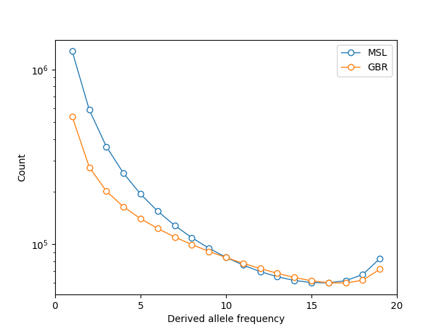
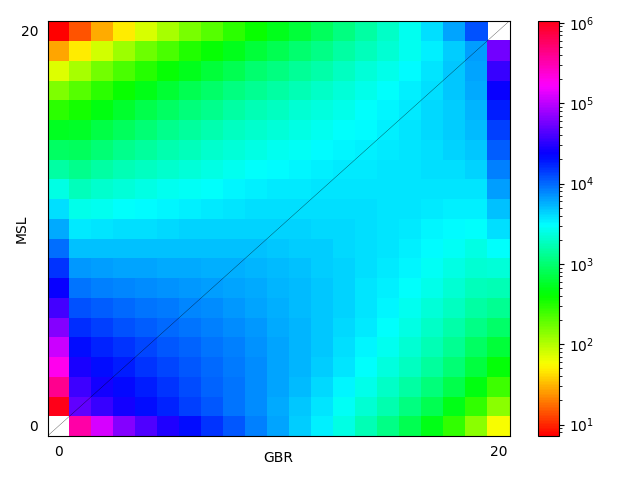
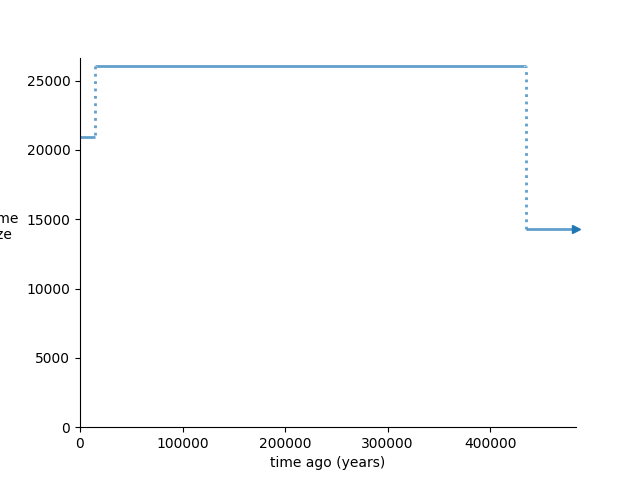
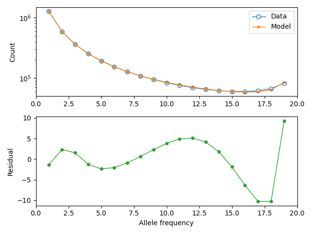
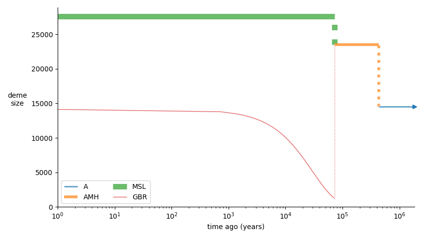
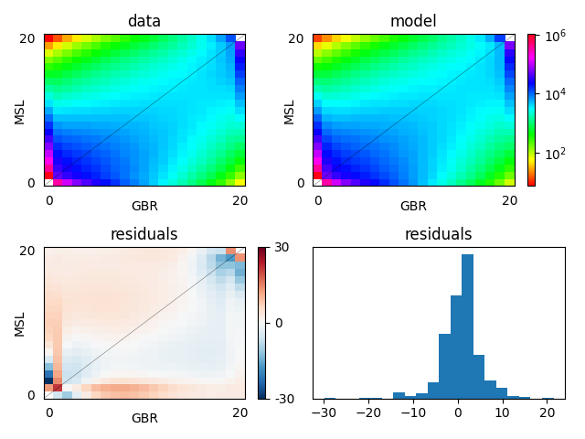
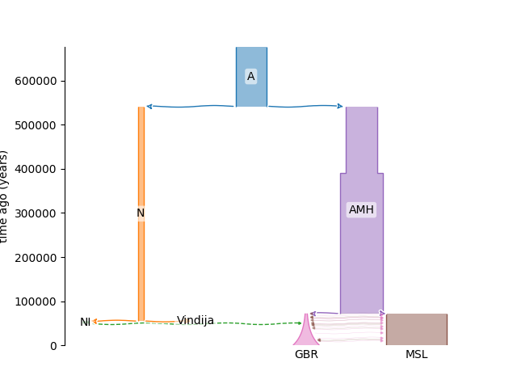
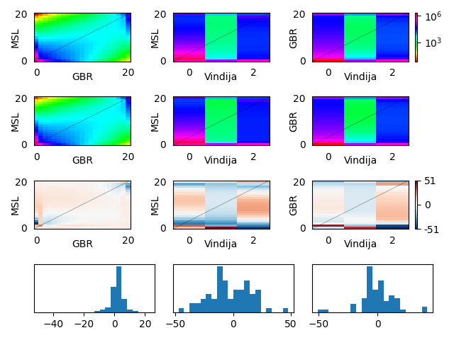

## Example 2: Inferring a model with empirical data 

In this section, we use moments and its Demes interface to fit a model of archaic admixutre to empirical data. Our data set consists of two modern human populations from the 1000 genomes catalog- the Mende from Sierre Leone (MSL) and British from Great Britain (GBR)- and a single Neandertal individual from Vindija cave in Croatia. We will model at a coarse scale the out-of-Africa migration and subsequent Neandertal admixture into the ancestors of non-African modern humans. 

### Estimating the SFS from sequence data

The tools we used to estimate the SFS are available in [data](data/). We lifted sequences for the Vindija Neandertal over from genome build hg19 to hg38 to allow direct comparison to a set of recently-resequenced high-coverage 1000 Genomes sequences (Byrska-Bishop et al, 2022). We apply the 1000 genomes "strict" mask, exclude exons and promoters plus 10-kilobase flanking regions around them, and ignore positions that lack high-confidence ancestral states. We also ignore sites which were not called in the four existing high-coverage archaic human sequences. We are left with approximately 1 billion base pairs.

### Projecting the estimated SFS down

With close to 100 diploid genomes spread across two populations, the SFS we have estimated is large. We may wish to project it down to a smaller size to speed up optimization and other operations. We can also marginalize populations out of the SFS, removing them and further reducing its size.

```python
import moments
sfs = moments.Spectrum.from_file("spectra/full_MSL_GBR_Vindija")
sfs.pop_ids
>>> ['MSL', 'GBR', 'Vindija']
sfs.sample_sizes
>>> array([170, 182, 2])

# marginalize to MSL and project to a size of 10 diploids
sfs_msl = sfs.marginalize([1, 2])
sfs_msl_projected = sfs_msl.project([20])
sfs_msl_projected.to_file("spectra/MSL")

# project MSL and GBR down to 10 diploids each
sfs_projected = sfs.project([20, 20, 2])
sfs_projected.to_file("spectra/MSL_GBR_Vindija")
```

Let's plot a comparison between the projected spectra for MSL and GBR. 

```python
import matplotlib.pyplot as plt
fig = plt.figure()
ax = plt.subplot(111)
ax.semilogy(sfs_projected.marginalize([1,2]), "-o", ms=6, lw=1, mfc="w", label="MSL")
ax.semilogy(sfs_projected.marginalize([0,2]), "-o", ms=6, lw=1, mfc="w", label="GBR")
ax.set_xlabel("Derived allele frequency")
ax.set_ylabel("Count")
ax.set_xticks([0, 5, 10, 15, 20])
ax.legend()
plt.savefig("comp_1d_MSL_GBR.png")
```



We can also plot a 2d spectrum for MSL and GBR using `moments.Plotting`:

```python
moments.Plotting.plot_single_2d_sfs(sfs_projected.marginalize([2]), out="comp_2d_MSL_GBR.png")
```



### Fitting marginal demographies 

Before fitting the three-population model, it is useful to estimate parameters for single-population models. This should help us to select reasonable topologies and initial parameter values before approaching more complex multi-population models. Let's begin with the MSL population and fit a model that proposes three epochs with constant effective population sizes. We assume a generation time of 29 years.

The model ([MSL_model.yaml](models/MSL/MSL_model.yaml)):
```YAML
description: 3-epoch model for the MSL population with piecewise-constant population sizes
time_units: years
generation_time: 29
demes: 
- name: MSL
  epochs: 
  - {start_size: 20000, end_time: 2e5}
  - {start_size: 25000, end_time: 2e4}
  - {start_size: 40000, end_time: 0}
```

We specify these parameters ([options_MSL_model.yaml](models/MSL/options_MSL.yaml)):
```YAML
parameters: 
- name: N_A 
  description: Ancestral population size
  lower_bound: 100
  upper_bound: 50000
  values: 
    - demes: 
        MSL: 
          epochs: 
            0: start_size
- name: T_AMH
  description: Time of first size expansion
  upper_bound: 1e6
  values: 
    - demes: 
        MSL: 
          epochs: 
            0: end_time
- name: N_AMH
  description: Population size following first expansion
  lower_bound: 100
  upper_bound: 100000
  values: 
    - demes: 
        MSL: 
          epochs: 
            1: start_size
- name: T_MSL
  description: Time of second size expansion
  lower_bound: 1e3
  values: 
    - demes: 
        MSL: 
          epochs: 
            1: end_time
- name: N_MSL
  description: Contemporary population size 
  lower_bound: 100
  upper_bound: 100000
  values: 
    - demes: 
        MSL: 
          epochs: 
            2: start_size
constraints: 
- params: [T_AMH, T_MSL]
  constraint: greater_than
```

For the sake of illustration, we let $u=1.5\cdot10^{-8}$ be our estimate of the human nucleotide mutation rate per generation. The optimization function in `moments.Demes` takes the compound parameter `uL`, so we must also know the length of sequence from which we estimated the SFS (here, $L=960,914,001$). We may choose to fit either the folded or unfolded SFS; when fitting an unfolded SFS, we can incorporate error in the assigment of ancestral nucleotide states into our inference by simaltaneously estimating a `misid` probability.

```python
import moments

# define paths and parameters
graph_file = "models/MSL/MSL_model.yaml"
options_file = "models/MSL/options_MSL.yaml"
data_file = "spectra/MSL"
output = "models/MSL/MSL_model.misid_fit.yaml"
u = 1.5e-8
L = 960914001
misid_guess = 0.03

data = moments.Spectrum.from_file(data_file)

# fit using the Powell algorithm
param_names, fit_params, ll = moments.Demes.Inference.optimize(
    graph_file, 
    options_file, 
    data, 
    maxiter=10000,
    fit_ancestral_misid=True, 
    misid_guess=misid_guess,
    uL=u * L, 
    verbose=50,
    output=output, 
    method="powell"
)

# print results
print("Best-fit log-likelihood:", -ll)
print("Best-fit parameters:")
for name, val in zip(param_names, fit_params):
    print(f"{name}\t{val:.3}")
```

This code will print convergence messages and the final best-fit parameters. After fitting, we can create plots showing the size history we've inferred and a comparison of the empirical and expected SFS using some built-in `moments` plotting functions;

```python
import demes 
import demesdraw 
import matplotlib.pyplot as plt

p_misid = 0.0318905

# load data and obtain model expectations (adjusted by fit misid pr.)
graph = demes.load(graph_file)
model = moments.Demes.SFS(graph, samples={"MSL": 20}, u=u, L=L)
model = moments.Misc.flip_ancestral_misid(model, p_misid)

# plot size history
fig, ax = plt.subplot(111)
demesdraw.size_history(graph, ax=ax)
plt.savefig("MSL_model.misid_fit.size_history.png")
plt.close()

# plot model expectation against data
moments.Plotting.plot_1d_comp_Poisson(
    model, data, residual="linear", out="MSL_model.misid_fit.comp_1d.png"
)
```





### Fitting a joint demography

Using the parameters inferred above, we now construct a 2-deme model where MSL and GBR diverge ~60,000 years ago ([models/MSL_GBR/MSL_GBR_model.yaml](models/MSL_GBR/MSL_GBR_model.yaml)).
```YAML
description: Simple OOA model with MSL, GBR demes and ancestral expansion.
time_units: years
generation_time: 29
demes:
- name: A
  epochs: 
  - {end_time: 4.5e5, start_size: 14000}
- name: AMH
  ancestors: [A]
  epochs:
  - {end_time: 6e4, start_size: 24000}
- name: MSL 
  ancestors: [AMH]
  epochs:
  - {end_time: 0, start_size: 21000}
- name: GBR
  ancestors: [AMH]
  epochs: 
  - {end_time: 0, start_size: 2000, end_size: 21000}
migrations:
- demes: [MSL, GBR]
  rate: 1e-5
```

We parameterize the population size in each epoch, the times of ancestral expansion and the out-of-Africa divergence, the migration rate and the final population size of GBR ([models/MSL_GBR/options_MSL_GBR.yaml](models/MSL_GBR/options_MSL_GBR.yaml)).
```YAML
parameters:
- name: N_A 
  description: Ancestral population size
  lower_bound: 100
  upper_bound: 100000
  values: 
    - demes: 
        A: 
          epochs: 
            0: start_size
- name: T_EXP
  decription: Time of ancestral size expansion
  upper_bound: 1e6
  values: 
    - demes: 
        A: 
          epochs: 
            0: end_time
- name: N_AMH
  description: Ancestral size following expansion
  lower_bound: 100
  upper_bound: 100000
  values: 
    - demes: 
        AMH: 
          epochs: 
            0: start_size
- name: T_OOA
  description: Divergence time of MSL, GBR
  lower_bound: 30e3
  values: 
    - demes: 
        AMH:  
          epochs: 
            0: end_time
- name: N_MSL
  description: Final size of MSL 
  lower_bound: 100
  upper_bound: 100000
  values: 
    - demes: 
        MSL: 
          epochs: 
            0: start_size
- name: N_OOA
  description: Initial size of GBR 
  lower_bound: 100
  upper_bound: 100000
  values: 
    - demes: 
        GBR: 
          epochs: 
            0: start_size
- name: N_GBR
  description: Final size of GBR
  lower_bound: 100
  upper_bound: 200000
  values: 
    - demes: 
        GBR: 
          epochs: 
            0: end_size
- name: m
  description: Symmetric migration rate between MSL, GBR
  lower_bound: 1e-8
  upper_bound: 1e-3
  values: 
    - migrations: 
        0: rate
constraints:
- params: [T_EXP, T_OOA]
  constraint: greater_than
```

After fitting this model using [models/MSL_GBR/fit_model.py](models/MSL_GBR/fit_model.py), we're left with some reasonable parameters and the fit to data plotted below;





### Introducing a third population

Now that we have a relatively well-fitting model for two modern human populations, we incorporate a Neandertal branch and fit the relevant parameters. It is useful to do this in multiple stages- here we first optimize a few parameters (Neandertal/African modern human divergence time, effective size of Neandertal populations, admixture pulse proportion) to obtain a reasonable fit, then run a round of optimization to further refine all the parameters we have considered above. The initial graph is [MSL_GBR_Vindija_model.yaml](models/MSL_GBR_Vindija_round1/MSL_GBR_Vindija_model.yaml) and the parameters are specified in [options_MSL_GBR_Vindija.yaml](models/MSL_GBR_Vindija_round1/options_MSL_GBR_Vindija.yaml):
```YAML
parameters: 
- name: T_NMH
  description: Split time of Neandertal and AMH
  upper_bound: 1e6
  lower_bound: 440000
  values: 
    - demes: 
        A: 
          epochs: 
            0: end_time     
- name: N_N
  description: Effective size of Neandertal demes
  lower_bound: 100
  values: 
    - demes: 
        N: 
          epochs: 
            0: start_size 
        NI: 
          epochs: 
            0: start_size 
        Vindija: 
          epochs: 
            0: start_size               
- name: T_NI
  description: Divergence time of `NI` and Vindija
  lower_bound: 55000
  values: 
    - demes: 
        N: 
          epochs: 
            0: end_time 
- name: p
  desciprion: Admixture proportion from `NI` to GBR
  lower_bound: 1e-5
  upper_bound: 0.10
  values: 
    - pulses: 
        0:  
          proportions: 0
constraints:
- params: [T_NMH, T_NI]
  constraint: greater_than
```

We use a single parameter for all Neandertal effective sizes, as the effective size of the NI deme in particular is not likely well-constrained. After optimizing these parameters, we run a second round of optimization using the model inferred in the first round ([MSL_GBR_Vindija_model.misid_fit.yaml](example2/models/MSL_GBR_Vindija_round1/MSL_GBR_Vindija_model.misid_fit.yaml)) and the parameters specified in [options_MSL_GBR_Vindija_round2.yaml](models/MSL_GBR_Vindija_round2/options_MSL_GBR_Vindija_round2.yaml). Our final best-fit model is plotted below.





### Computing confidence invervals

We may wish to quantify the uncertainty in our best-fit parameter values...

```python
import demes
import moments

graph_file = "MSL_GBR_Vindija_round2.misid_fit.yaml"
options_file = "options_MSL_GBR_Vindija_round2.yaml"
data_file = "../../spectra/MSL_GBR_Vindija"
u = 1.5e-8
L = 960914001
p_misid = 0.0223
data = moments.Spectrum.from_file(data_file)
std_errs = moments.Demes.Inference.uncerts(
    graph_file,
    options_file,
    data,
    uL=u * L,
    fit_ancestral_misid=True,
    misid_fit=p_misid,
)
```

We can print the results using this;

```python
# load parameter names and best-fit values
builder = demes.load(graph_file).asdict()
options = moments.Demes.Inference._get_params_dict(options_file)
param_names, fit_params, _, __ = \
    moments.Demes.Inference._set_up_params_and_bounds(options, builder)
# print results
print(r"95% confidence intervals:")
print("param\t2.5%\t97.5%")
for name, val, err in zip(param_names, fit_params, std_errs):
    print(f"{name}\t{val - 1.96 * err:.3}\t{val + 1.96 * err:.3}")
```


### References