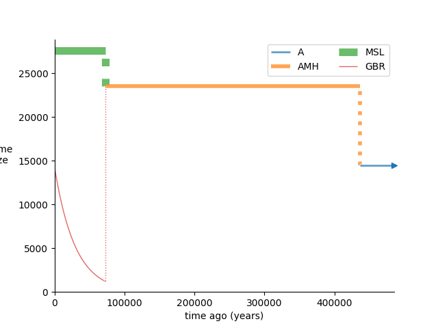

## Example 2: Inferring a model from empirical data 

In this section, we use `moments` and its `demes` interface to infer a 3-population model with empirical data. Our data set consists of samples from two modern human populations sequenced in the 1000 genomes project- the Mende from Sierre Leone (MSL) and British from Great Britain (GBR)- and a single Neandertal individual from Vindija cave in Croatia. We construct a simple model of the out-of-Africa expansion of modern humans and the following admixture with Neandertals.

### Estimating the SFS from sequence data

The tools we used to estimate the SFS are available in [data](data/). We lifted sequences for the Vindija Neandertal over from genome build hg19 to hg38 ([data/liftover/](data/liftover/)) to allow a direct comparison to a set of recently-resequenced high-coverage 1000 Genomes sequences (Byrska-Bishop et al, 2022). We apply the 1000 genomes "strict" mask, exclude exons and promoters plus 10-kilobase flanking regions around them, and ignore positions that lack high-confidence ancestral states. We also ignore sites which were not genotyped in the four existing high-coverage archaic human sequences. We are left with approximately 1 billion base pairs of sequence. The scripts we used to perform these operations and estimate the SFS are available in [data/parsing/](data/parsing/) and [data/tools](data/tools/).

### Projecting the estimated SFS down

With close to 100 diploid genomes spread across two populations, the SFS we have estimated is large. We may wish to project it down to a smaller size to speed up optimization and other operations. We can also marginalize populations out of the SFS, removing them and further reducing its size. First we load the SFS and inspect its attributes; 
```python
import moments

sfs = moments.Spectrum.from_file("spectra/full_MSL_GBR_Vindija")
print(sfs.pop_ids)
print(sfs.sample_sizes)
```
```
['MSL', 'GBR', 'Vindija']
array([170, 182, 2])
```
We can use projection and marginalization to create compact one, two and three-dimensional versions of the large three-population SFS, so that we don't need to repeat these operations every time we fit a model. These can be saved to a format readable by `moments` using the `to_file` method. 
```python
# marginalize to MSL, project it to 10 diploids and save the result
sfs_msl = sfs.marginalize([1, 2])
sfs_msl_projected = sfs_msl.project([20])
sfs_msl_projected.to_file("spectra/MSL")

# project MSL and GBR down to 10 diploids and save the result
sfs_projected = sfs.project([20, 20, 2])
sfs_projected.to_file("spectra/MSL_GBR_Vindija")
```

Let's plot a comparison between the projected spectra for MSL and GBR. 
```python
import matplotlib.pyplot as plt

fig = plt.figure()
ax = plt.subplot(111)
ax.semilogy(sfs_projected.marginalize([1,2]), "-o", ms=6, lw=1, mfc="w", label="MSL")
ax.semilogy(sfs_projected.marginalize([0,2]), "-o", ms=6, lw=1, mfc="w", label="GBR")
ax.set_xlabel("Derived allele frequency")
ax.set_ylabel("Count")
ax.set_xticks([0, 5, 10, 15, 20])
ax.legend()
plt.savefig("comp_1d_MSL_GBR.png")
```


We can also plot a 2d spectrum as a heatmap using a function from `moments.Plotting`:

```python
moments.Plotting.plot_single_2d_sfs(sfs_projected.marginalize([2]), out="comp_2d_MSL_GBR.png")
```


### Fitting marginal demographies 

Before fitting the three-population model, it is useful to estimate parameters for single-population models. This will help us to select reasonable topologies and initial parameter values when approaching more complex multi-population models. Let's begin with the MSL population and fit a model that proposes three epochs with constant effective population sizes. We assume a generation time of 29 years. The model ([models/MSL/MSL_model.yaml](models/MSL/MSL_model.yaml)) is written as:
```YAML
description: 3-epoch model for MSL
time_units: years
generation_time: 29
demes: 
- name: MSL
  epochs: 
  - {start_size: 20000, end_time: 200000}
  - {start_size: 25000, end_time: 20000}
  - {start_size: 40000, end_time: 0}
```

We parameterize each effective size and the two epoch transition times ([models/MSL/MSL_options.yaml](models/MSL/MSL_options.yaml)):
```YAML
parameters: 
- name: N_A 
  description: Ancestral population size
  lower_bound: 100
  upper_bound: 50000
  values: 
    - demes: 
        MSL: 
          epochs: 
            0: start_size
- name: T_AMH
  description: Time of first size change
  upper_bound: 1000000
  values: 
    - demes: 
        MSL: 
          epochs: 
            0: end_time
- name: N_AMH
  description: Population size following first size change
  lower_bound: 100
  upper_bound: 100000
  values: 
    - demes: 
        MSL: 
          epochs: 
            1: start_size
- name: T_MSL
  description: Time of second size change
  lower_bound: 1000
  values: 
    - demes: 
        MSL: 
          epochs: 
            1: end_time
- name: N_MSL
  description: Contemporary population size 
  lower_bound: 100
  upper_bound: 100000
  values: 
    - demes: 
        MSL: 
          epochs: 
            2: start_size
constraints: 
- params: [T_AMH, T_MSL]
  constraint: greater_than
```

Let `u = 1.5e-8` be our estimate of the per-generation nucleotide mutation rate in humans. Here we use a Poisson likelihood function, which requies that we give the compound parameter `uL = u * L` as an argument to the `moments.Demes` optimization function. We must therefore know the length of the sequence from which we estimated the SFS- here, the number of called sites that passed our filters was `L = 960914001`. We may choose to fit either the folded or unfolded SFS; when fitting an unfolded SFS, we can incorporate error in the assigment of ancestral nucleotide states into our inference by simaltaneously estimating an ancestral misidentification probability that takes an initial value `misid_guess`.

```python
# define model paths
graph_file = "models/MSL/MSL_model.yaml"
options_file = "models/MSL/MSL_options.yaml"

# define data path and load data
data_file = "spectra/MSL"
data = moments.Spectrum.from_file(data_file)

# define output graph filename
output_file = "models/MSL/MSL_model.misid_fit.yaml"

# define parameters
u = 1.5e-8
L = 960914001
U = u * L
misid_guess = 0.03

# fit using the Powell algorithm
param_names, fit_params, ll = moments.Demes.Inference.optimize(
    graph_file, 
    options_file, 
    data, 
    uL=U, 
    fit_ancestral_misid=True, 
    misid_guess=misid_guess,
    verbose=50,
    output=output_file, 
    maxiter=10000,
    method="powell",
    overwrite=True
)
```

We can print the results like so;
```python
# print results
print("Best-fit log-likelihood:", -ll)
print("Best-fit parameters:")
for name, value in zip(param_names, fit_params):
    print(f"{name}\t{value:.3}")
```
```
Best-fit log-likelihood: -356.03751402092166
Best-fit parameters:
N_A     1.43e+04
T_AMH   4.35e+05
N_AMH   2.61e+04
T_MSL   1.5e+04
N_MSL   2.1e+04
p_misid 0.0331
```

After fitting the model, we can create plots showing the size history we've inferred and a comparison of the empirical and expected SFS using the package `demesdraw` and the built-in `moments.Plotting` plotting functions. 

```python
import demes, demesdraw 
import matplotlib.pyplot as plt

# retrieve `p_misid`, which was returned as the last element of `fit_params`
p_misid = fit_params[-1]

# load the fitted graph
fit_graph = demes.load(output_file)

# compute model expectations
model = moments.Demes.SFS(fit_graph, samples={"MSL": 20}, u=u, L=L)

# adjust model expectations to account for ancestral state misidentification
model = moments.Misc.flip_ancestral_misid(model, p_misid)

# plot size history
ax = plt.subplot(111)
demesdraw.size_history(fit_graph, ax=ax)
plt.savefig("models/MSL/MSL_model.misid_fit.size_history.png")
plt.close()

# plot fit to data
moments.Plotting.plot_1d_comp_Poisson(
    model, data, residual="Anscombe", 
    out="models/MSL/MSL_model.misid_fit.comp_1d.png"
)
```


### Fitting a joint demography

We also fitted a one-population model for GBR incorporating a sharp contraction followed by exponential growth in the same manner ([models/GBR/GBR_model.misid_fit.yaml](models/GBR/GBR_model.misid_fit.yaml)). Using the parameters inferred in the marginal MSL and GBR models, we now construct a 2-deme model where MSL and GBR diverge ~60,000 years ago ([models/MSL_GBR/MSL_GBR_model.yaml](models/MSL_GBR/MSL_GBR_model.yaml)).
```YAML
description: 3-epoch model for MSL, GBR with ancestral expansion
time_units: years
generation_time: 29
demes:
- name: A
  epochs: 
  - {end_time: 200000, start_size: 15000}
- name: AMH
  ancestors: [A]
  epochs:
  - {end_time: 60000, start_size: 25000}
- name: MSL 
  ancestors: [AMH]
  epochs:
  - {end_time: 0, start_size: 21000}
- name: GBR
  ancestors: [AMH]
  epochs: 
  - {end_time: 0, start_size: 2000, end_size: 20000}
migrations:
- demes: [MSL, GBR]
  rate: 1e-5
```

We parameterize every feature of the model ([models/MSL_GBR/MSL_GBR_options.yaml](models/MSL_GBR/MSL_GBR_options.yaml)). 
```YAML
parameters:
- name: N_A 
  description: Ancestral population size
  lower_bound: 100
  upper_bound: 100000
  values: 
    - demes: 
        A: 
          epochs: 
            0: start_size
- name: T_EXP
  decription: Time of ancestral expansion
  upper_bound: 1e6
  values: 
    - demes: 
        A: 
          epochs: 
            0: end_time
- name: N_AMH
  description: Ancestral size following expansion
  lower_bound: 100
  upper_bound: 100000
  values: 
    - demes: 
        AMH: 
          epochs: 
            0: start_size
- name: T_OOA
  description: Divergence time of MSL, GBR
  lower_bound: 30e3
  values: 
    - demes: 
        AMH:  
          epochs: 
            0: end_time
- name: N_MSL
  description: Final size of MSL 
  lower_bound: 100
  upper_bound: 100000
  values: 
    - demes: 
        MSL: 
          epochs: 
            0: start_size
- name: N_OOA
  description: Initial size of GBR 
  lower_bound: 100
  upper_bound: 100000
  values: 
    - demes: 
        GBR: 
          epochs: 
            0: start_size
- name: N_GBR
  description: Final size of GBR
  lower_bound: 100
  upper_bound: 200000
  values: 
    - demes: 
        GBR: 
          epochs: 
            0: end_size
- name: m
  description: Symmetric migration rate between MSL, GBR
  lower_bound: 1e-8
  upper_bound: 1e-3
  values: 
    - migrations: 
        0: rate
constraints:
- params: [T_EXP, T_OOA]
  constraint: greater_than
```

This is fitted using
```python
# define model paths
graph_file = "models/MSL_GBR/MSL_GBR_model.yaml"
options_file = "models/MSL_GBR/MSL_GBR_options.yaml"

# define data path and load data
data_file = "spectra/MSL_GBR"
data = moments.Spectrum.from_file(data_file)

# define output graph filename
output_file = "models/MSL_GBR/MSL_GBR_model.misid_fit.yaml"

# define parameters
u = 1.5e-8
L = 960914001
U = u * L
misid_guess = 0.03

# fit using the fmin algorithm
param_names, fit_params, ll = moments.Demes.Inference.optimize(
    graph_file, 
    options_file, 
    data, 
    maxiter=10000,
    fit_ancestral_misid=True, 
    misid_guess=misid_guess,
    uL=U, 
    verbose=1,
    output=output_file, 
    method="fmin",
    overwrite=True
)

# print results
print("Best-fit log-likelihood:", -ll)
print("Best-fit parameters:")
for name, value in zip(param_names, fit_params):
    print(f"{name}\t{value:.3}")
```
```
...
Best-fit log-likelihood: -6960.233060210065
Best-fit parameters:
N_A     1.45e+04
T_EXP   4.37e+05
N_AMH   2.35e+04
T_OOA   7.25e+04
N_MSL   2.76e+04
N_OOA   1.2e+03
N_GBR   1.41e+04
m       3.35e-05
p_misid 0.0309
```

We are left with some reasonable parameters and the fit to data plotted below;
```python
# retrive misid
p_misid = fit_params[-1]

# load output graph
fit_graph = demes.load(output_file)

# compute model expectations
model = moments.Demes.SFS(fit_graph, samples={"MSL": 20, "GBR": 20}, u=u, L=L)
model = moments.Misc.flip_ancestral_misid(model, p_misid)

# plot size history
ax = plt.subplot(111)
demesdraw.size_history(fit_graph, ax=ax)
plt.savefig("models/MSL_GBR/MSL_GBR_model.misid_fit.size_history.png")
plt.close()

# plot joint fit for MSL, GBR
moments.Plotting.plot_2d_comp_Poisson(
    model, data, residual="linear", 
    out="models/MSL_GBR/MSL_GBR_model.misid_fit.comp_2d.png"
)
```



### Introducing a third population

Now that we have a relatively well-fitting model describing two modern human populations, we incorporate a Neandertal branch and fit the relevant parameters. It is useful to do this in multiple steps- here we first optimize a few new parameters (Neandertal/modern human divergence time, effective size of Neandertal populations, divergence time of the sampled and introgressing Neandertals, and Neandertal to GBR admixture pulse proportion) to obtain a reasonable fit, then run a second round of optimization to further refine all the parameters we considered in the two-population model as well. We fix the time of Neandertal admixture to 50 kya (see Sümer et al. 2025) and use a single size parameter $N_N$ for all Neandertal demes, as we may expect these parameters to be poorly constrained given our small Neandertal sample size. The initial graph is [models/MSL_GBR_Vindija_step1/MSL_GBR_Vindija_model.yaml](models/MSL_GBR_Vindija_step1/MSL_GBR_Vindija_model.yaml):
```YAML
description: Model of Vindija Neandertal, MSL and GBR lineages with admixture.
time_units: years
generation_time: 29
demes:
- name: A
  epochs:
  - {end_time: 6e5, start_size: 14502.424743309206}
- name: N 
  ancestors: [A]
  epochs: 
  - {start_size: 3000, end_time: 125000}
- name: NI
  ancestors: [N]
  epochs: 
  - {start_size: 3000, end_time: 50000}
- name: Vindija
  ancestors: [N]
  epochs: 
  - {start_size: 3000, end_time: 55000}
- name: AMH
  ancestors: [A]
  epochs:
  - {end_time: 436166.1984650331, start_size: 14502.424743309206}
  - {end_time: 72526.00759273666, start_size: 23525.824400305177}
- name: MSL
  ancestors: [AMH]
  epochs:
  - {end_time: 0, start_size: 27591.878990713663}
- name: GBR
  ancestors: [AMH]
  epochs:
  - {end_time: 0, start_size: 1201.9212244444434, end_size: 14129.839474007915}
migrations:
- demes: [MSL, GBR]
  rate: 3.345205234558448e-05
pulses:
- sources: [NI]
  proportions: [0.02]
  dest: GBR
  time: 50000
```

and the parameters are specified in [models/MSL_GBR_Vindija_step1/MSL_GBR_Vindija_options.yaml](models/MSL_GBR_Vindija_step1/MSL_GBR_Vindija_options.yaml):
```YAML
parameters: 
- name: T_NMH
  description: Split time of Neandertal and AMH
  upper_bound: 1e6
  lower_bound: 440000
  values: 
    - demes: 
        A: 
          epochs: 
            0: end_time     
- name: N_N
  description: Effective size of Neandertal demes
  lower_bound: 100
  values: 
    - demes: 
        N: 
          epochs: 
            0: start_size 
        NI: 
          epochs: 
            0: start_size 
        Vindija: 
          epochs: 
            0: start_size               
- name: T_NI
  description: Divergence time of `NI` and Vindija
  lower_bound: 55000
  values: 
    - demes: 
        N: 
          epochs: 
            0: end_time 
- name: p
  desciprion: Admixture proportion from `NI` to GBR
  lower_bound: 1e-5
  upper_bound: 0.10
  values: 
    - pulses: 
        0:  
          proportions: 0
constraints:
- params: [T_NMH, T_NI]
  constraint: greater_than
```

We plot the fitted model using
```python
# load the model
fit_graph = demes.load("models/MSL_GBR_Vindija_step1/MSL_GBR_Vindija_model.misid_fit.yaml")

# plot tubes
ax = plt.subplot(111)
demesdraw.tubes(fit_graph, ax=ax)
plt.savefig("models/MSL_GBR_Vindija_step1/MSL_GBR_Vindija_model.misid_fit.tubes.png")
plt.close()
```


We find the NI/Vindija divergence time `T_NI` to be poorly constrained, so in the second round of optimization we fix it at a value supported by the literature (90 kya, see Prüfer et al. 2017). The free parameters for the second step are specified in [models/MSL_GBR_Vindija_step2/MSL_GBR_Vindija_options_step2.yaml](models/MSL_GBR_Vindija_step2/MSL_GBR_Vindija_options_step2.yaml)  and their initial values are given by the best fit plotted above [models/MSL_GBR_Vindija_step2/MSL_GBR_Vindija_model_step2.yaml](models/MSL_GBR_Vindija_step2/MSL_GBR_Vindija_model_step2.yaml). We fit the final model using
```python
# define model paths
graph_file = "models/MSL_GBR_Vindija_step2/MSL_GBR_Vindija_model_step2.yaml"
options_file = "models/MSL_GBR_Vindija_step2/MSL_GBR_Vindija_options_step2.yaml"

# define data path and load data
data_file = "spectra/MSL_GBR_Vindija"
data = moments.Spectrum.from_file(data_file)

# define output graph filename
output_file = "models/MSL_GBR_Vindija_step2/MSL_GBR_Vindija_model_step2.misid_fit.yaml"

# define parameters
u = 1.5e-8
L = 960914001
U = u * L
misid_guess = 0.03

# fit using the Powell algorithm
param_names, fit_params, ll = moments.Demes.Inference.optimize(
    graph_file, 
    options_file, 
    data, 
    maxiter=10000,
    fit_ancestral_misid=True, 
    misid_guess=misid_guess,
    uL=U, 
    verbose=1,
    output=output_file, 
    method="powell",
    overwrite=True
)

# print results
print("Best-fit log-likelihood:", -ll)
print("Best-fit parameters:")
for name, value in zip(param_names, fit_params):
    print(f"{name}\t{value:.3}")
```
```
Best-fit log-likelihood: -24640.177263672063
Best-fit parameters:
N_A     1.54e+04
T_NMH   5.47e+05
N_N     2.77e+03
p       0.0271
T_EXP   3.79e+05
N_AMH   2.12e+04
T_OOA   7.77e+04
N_MSL   2.98e+04
N_OOA   1.2e+03
N_GBR   1.08e+04
m       4.36e-05
p_misid 0.0223
```

We plot the result using the following:
```python
# define p_misid 
p_misid = 0.0223

# load output graph
fit_graph = demes.load("models/MSL_GBR_Vindija_step2/MSL_GBR_Vindija_model_step2.misid_fit.yaml")

# compute model expectations
model = moments.Demes.SFS(
    fit_graph, samples={"MSL": 20, "GBR": 20, "Vindija": 2}, u=u, L=L
)
model = moments.Misc.flip_ancestral_misid(model, p_misid)

# plot tubes
ax = plt.subplot(111)
demesdraw.tubes(fit_graph, ax=ax)
plt.savefig("models/MSL_GBR_Vindija_step2/MSL_GBR_Vindija_model_step2.misid_fit.tubes.png")
plt.close()

# plot 3-way comparison
moments.Plotting.plot_3d_comp_Poisson(
    model, data, residual="Anscombe", 
    out="models/MSL_GBR_Vindija_step2/MSL_GBR_Vindija_model_step2.misid_fit.comp_3d.png"
)
```


### Computing confidence invervals

We may wish to quantify the uncertainty in our best-fit parameter values. We can do this using the `moments.Demes.Inference.uncerts` function. Here we use the default `FIM` method, which does not take bootstrapped data. As described in example 1, this method underestimates parameter uncertainties. We can then print the estimated 95% confidence intervals about our best-fit parameters. 
```python
# define p_misid 
p_misid = 0.0223

# compute confidence intervals using FIM 
log_file = "models/MSL_GBR_Vindija_step2/MSL_GBR_Vindija_model_step2.misid_fit.uncerts.txt"
uncerts = moments.Demes.Inference.uncerts(
    output_file,
    options_file,
    data,
    uL=U,
    method="FIM",
    fit_ancestral_misid=True,
    misid_fit=p_misid,
    verbose=10,
    output=log_file,
    overwrite=True,
    eps=1e-2
)

# print confidence intervals
print("95% confidence intervals:")
print("param\t2.5%\t97.5%")
for name, value, err in zip(param_names, fit_params, uncerts):
    print(f"{name}\t{value - 1.96 * err:.3}\t{value + 1.96 * err:.3}")
```
```
95% confidence intervals:
param   2.5%    97.5%
N_A     1.54e+04        1.54e+04
T_NMH   5.46e+05        5.48e+05
N_N     2.76e+03        2.78e+03
p       0.0268  0.0273
T_EXP   3.72e+05        3.86e+05
N_AMH   2.11e+04        2.13e+04
T_OOA   7.72e+04        7.83e+04
N_MSL   2.96e+04        3e+04
N_OOA   1.19e+03        1.22e+03
N_GBR   1.06e+04        1.1e+04
m       4.31e-05        4.41e-05
```

We can see that the `FIM` 95% confidence intervals are very tight. We can repeat the same process with the first-step model by loading its fitted parameters;
```python
# define data path and load data
data_file = "spectra/MSL_GBR_Vindija"
data = moments.Spectrum.from_file(data_file)

# define graph and options filenames
graph_file = "models/MSL_GBR_Vindija_step1/MSL_GBR_Vindija_model.misid_fit.yaml"
options_file = "models/MSL_GBR_Vindija_step1/MSL_GBR_Vindija_options.yaml"

# define fitted misid
p_misid = 0.0250059

# compute uncerts
log_file = "models/MSL_GBR_Vindija_step1/MSL_GBR_Vindija_model.misid_fit.uncerts.txt"
uncerts = moments.Demes.Inference.uncerts(
    graph_file,
    options_file,
    data,
    uL=U,
    method="FIM",
    fit_ancestral_misid=True,
    misid_fit=p_misid,
    verbose=10,
    output=log_file,
    overwrite=True,
    eps=1e-2
)

# load parameter names and values using moments.Demes functionality
builder = demes.load(graph_file).asdict()
options = moments.Demes.Inference._get_params_dict(options_file)
param_names, fit_params, _, __ = \
    moments.Demes.Inference._set_up_params_and_bounds(options, builder)

# add p_misid to parameters
param_names.append("p_misid")
fit_params = np.append(fit_params, p_misid)

# print confidence intervals
print("95% confidence intervals:")
print("param\t2.5%\t97.5%")
for name, value, err in zip(param_names, fit_params, uncerts):
    print(f"{name}\t{value - 1.96 * err:.3}\t{value + 1.96 * err:.3}")
```
```
95% confidence intervals:
param   2.5%    97.5%
T_NMH   5.66e+05        5.68e+05
N_N     2.83e+03        2.85e+03
T_NI    5.38e+04        6.17e+04
p       0.0219  0.0223
```

### References

Marta Byrska-Bishop et al. High-coverage whole-genome sequencing of the expanded 1000 Genomes Project cohort including 602 trios. Cell 185, no. 18 3426-3440, 2022. 

Kay Prüfer et al. A high-coverage Neandertal genome from Vindija Cave in Croatia. Science 358, no. 6363 655-658, 2017.

Arev Sümer et al. Earliest modern human genomes constrain timing of Neanderthal admixture. Nature 638, no. 8051 711-717, 2025.